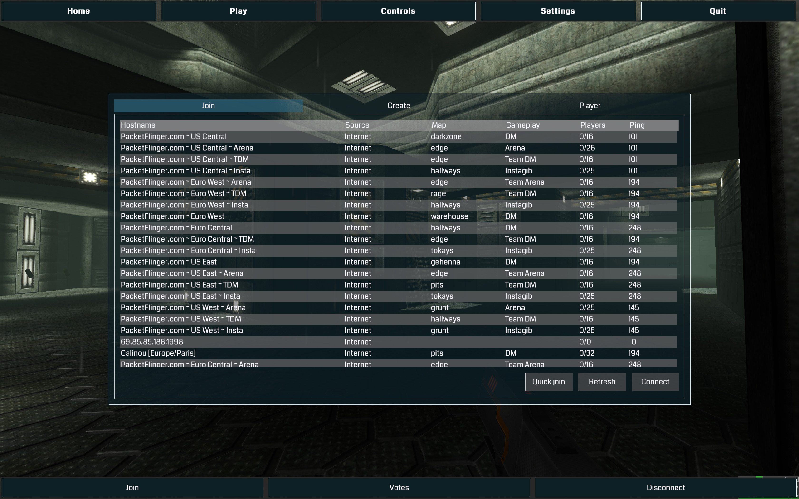
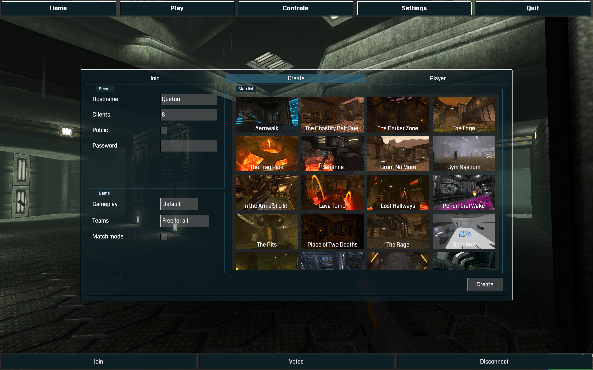
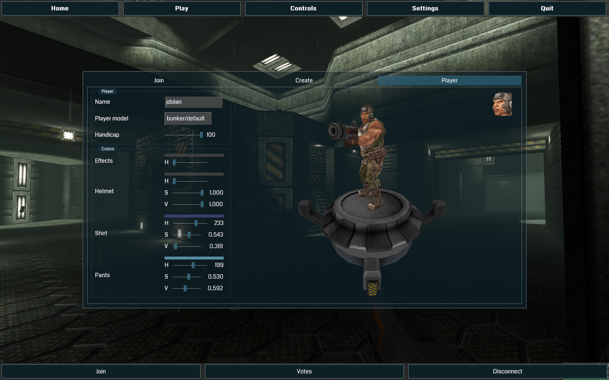

[](https://github.com/jdolan/ObjectivelyMVC/actions/workflows/build.yml)
[](https://opensource.org/licenses/Zlib)


# ObjectivelyMVC
Object oriented MVC framework for SDL3 and C.

Zlib [license](./COPYING).

## About

ObjectivelyMVC is a cross-platform user interface framework for [SDL3](https://libsdl.org) and C.
It is geared towards building high-quality, modern user interfaces within video games. It is built on [Objectively](https://github.com/jdolan/Objectively) and
[ObjectivelyGPU](https://github.com/jdolan/ObjectivelyGPU).


## Features

* **Cross-platform** works on Android, iOS, macOS, Linux and Windows
* **Does not hijack your main loop** — your game owns the window, GPU device, and events; you call it each frame
* **Complete widget set**: Button, Checkbox, Slider, Select, TextView, TableView, CollectionView, TabView, PageView, and more
* **Programmatic or JSON-driven layouts** for declarative, data-driven UI
* **Fully themable** via a CSS-inspired Selector / Style / Stylesheet system
* **High-DPI / Retina ready** — high-density display detection with SDL_ttf TrueType font rendering
* **Object oriented MVC in C** via [Objectively](https://github.com/jdolan/Objectively), without imposing C++

## tl;dr

Describe an entire interface in JSON and inflate it with a single call — outlets bind the named Views straight into your controller:

```c
Outlet outlets[] = MakeOutlets(
  MakeOutlet("apply", &this->apply),
  MakeOutlet("slider", &this->slider)
);

View *panel = $$(View, viewWithResourceName, "Settings.json", outlets);
$(self->view, addSubview, panel);

this->apply->delegate.didClick = didClickApply;
```

And ObjectivelyMVC never hijacks your main loop. Your game owns the window, the GPU device and the events; you simply hand it each event and a frame to draw into:

```c
$(windowController, respondToEvent, &event);
...
$(windowController, render, commands, framebuffer);
```

## Getting Started

Consult the **[Installation](https://jdolan.github.io/ObjectivelyMVC/install.html)** guide for dependencies, building, and linking.

## User Guide

Consult the **[User Guide](https://jdolan.github.io/ObjectivelyMVC/guide.html)** to build your first interface — fonts, views and controls, JSON layout, theming, and resource loading.

## API Documentation

Browse the [API Documentation](https://jdolan.github.io/ObjectivelyMVC/) to explore the library.

## Examples & projects using ObjectivelyMVC

1. [Hello](Examples/Hello.c) creates a window and renders a themed menu over a 3D scene using JSON layout — walked through in the [Guide](https://jdolan.github.io/ObjectivelyMVC/guide.html).
1. [Objectively](https://github.com/jdolan/Objectively) is the object oriented framework ObjectivelyMVC is built on.
1. [ObjectivelyGPU](https://github.com/jdolan/ObjectivelyGPU) is the graphics framework ObjectivelyMVC renders with.
1. [Quetoo](https://github.com/jdolan/quetoo) is a free first-person shooter that uses ObjectivelyMVC for its in-game user interface.




