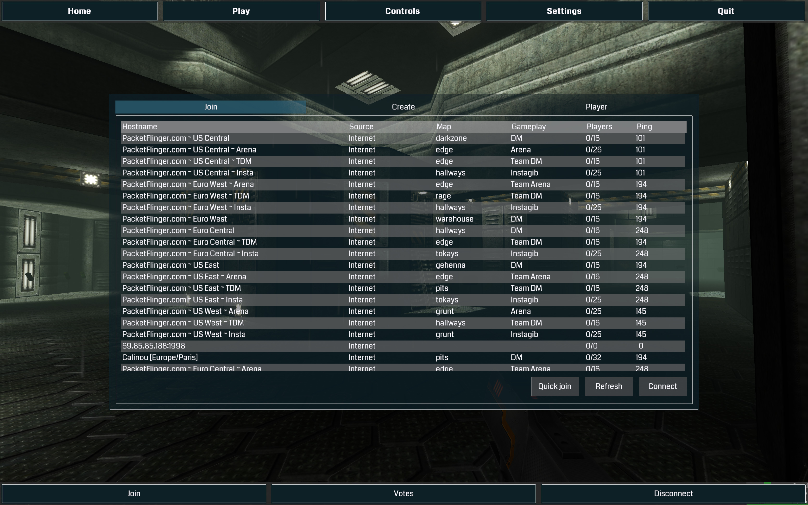
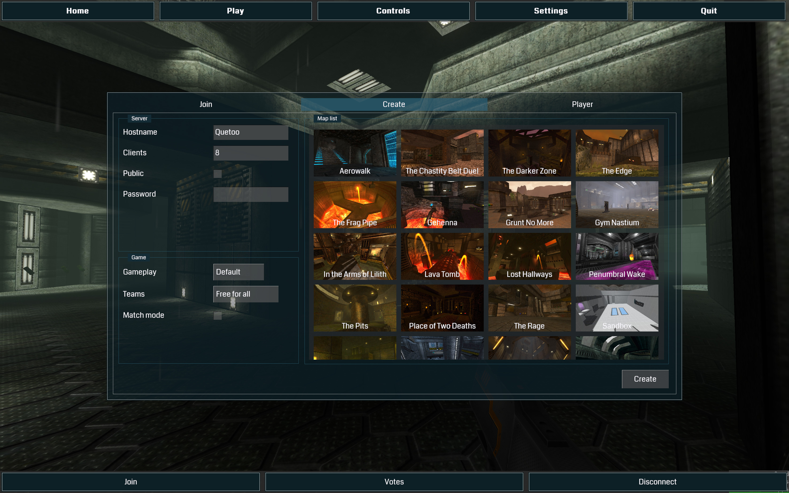
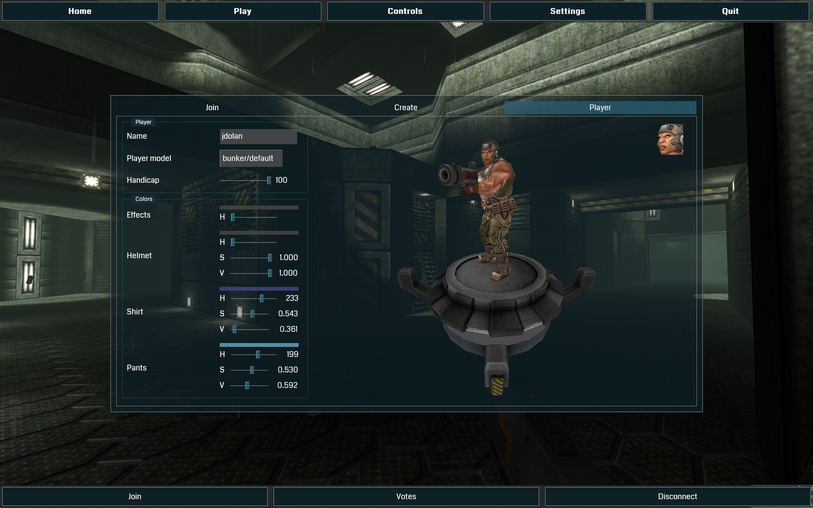

[](https://github.com/jdolan/ObjectivelyMVC/actions/workflows/build.yml)
[](https://opensource.org/licenses/Zlib)


# ObjectivelyMVC
Object oriented MVC framework for SDL3 and C.

Zlib [license](./COPYING).

## About

ObjectivelyMVC is a cross-platform user interface framework for [SDL3](https://libsdl.org) and C.
It is geared towards building high-quality, modern user interfaces within video games. It is built on [Objectively](https://github.com/jdolan/Objectively) and
[ObjectivelyGPU](https://github.com/jdolan/ObjectivelyGPU).


## Features

* **Cross-platform** works on Android, iOS, macOS, Linux and Windows
* **Does not hijack your main loop** — your game owns the window, GPU device, and events; you call it each frame
* **Complete widget set**: Button, Checkbox, Slider, Select, TextView, TableView, CollectionView, TabView, PageView, and more
* **Programmatic or JSON-driven layouts** for declarative, data-driven UI
* **Fully themable** via a CSS-inspired Selector / Style / Stylesheet system
* **High-DPI / Retina ready** — high-density display detection with SDL_ttf TrueType font rendering
* **Object oriented MVC in C** via [Objectively](https://github.com/jdolan/Objectively), without imposing C++

## tl;dr

Describe an entire interface in JSON and inflate it with a single call — outlets bind the named Views straight into your controller:

```c
Outlet outlets[] = MakeOutlets(
  MakeOutlet("apply", &this->apply),
  MakeOutlet("slider", &this->slider)
);

View *panel = $$(View, viewWithResourceName, "Settings.json", outlets);
$(self->view, addSubview, panel);

this->apply->delegate.didClick = didClickApply;
```

And ObjectivelyMVC never hijacks your main loop. Your game owns the window, the GPU device and the events; you simply hand it each event and a frame to draw into:

```c
$(windowController, respondToEvent, &event);
...
$(windowController, render);
```

## Layout and styling are CSS-driven

**Read this before writing any View code.** Layout is driven by the Selector / Style / Stylesheet
system, not by assigning fields in C. Getting this backwards is the single most common way to
waste an afternoon.

### Never assign a `@styled` attribute in C

Attributes documented `@styled` in the headers — `alignment`, `autoresizingMask`, `padding`,
`frame.w` / `frame.h` (as `width` / `height`), `minSize`, `maxSize`, `pointerEvents`,
`backgroundColor`, `borderWidth`, `visibility`, `StackView::axis`, `StackView::spacing` and the
rest — are bound from the computed Style by `View::applyStyle` on **every** theme application.
Anything assigned in C is silently overwritten the next time the theme is applied, which is to say
almost immediately:

```c
/* WRONG: overwritten by the next applyStyle, which binds `axis` from the computed style */
stackView->axis = StackViewAxisHorizontal;
((View *) stackView)->alignment = ViewAlignmentBottomCenter;
```

```css
/* RIGHT */
MyControlsView {
  alignment: bottom-center;
  axis: horizontal;
}
```

Assign in C only what is *not* styled: delegates, data source callbacks, model values
(`Slider::min` / `max` / `value`) and structure (`addSubview`). To target a view from CSS, give it
a class with `$(view, addClassName, "myClass")`, or an identifier, and select on that.

### The default stylesheet already styles everything

`Assets/stylesheet.css` is always in the Theme, and its rules apply to your views whether you
expect them to or not. The defaults that most often surprise:

| Rule | Consequence |
| --- | --- |
| `StackView { axis: vertical }` | A stack is **vertical** unless your CSS says otherwise |
| `Button { min-width: 100; padding: 8 8 8 8 }` | An icon button is **at least 100px wide** until `min-width` is overruled |
| `Control { min-height: 32 }` | ...and at least 32px tall, likewise |
| `StackView { autoresizing-mask: contain }` | Stacks size to their content; most other views do not |

Setting `width` alone does **not** shrink a Button: `min-width` clamps it. Override both.

### Sizing

A View with `autoresizing-mask: none` is exactly its `frame`. `contain` sizes it to fit its
subviews, `fill` expands it to its superview, and `width` / `height` do one axis each. A container
left at `none` with no explicit size is 0x0, and its subviews are then laid out from that empty
box: they appear to scatter, or to spill outside their parent, rather than simply not drawing.

### Hit testing

`View::hitTest` descends into subviews *before* consulting a view's own `pointerEvents`, so a child
with `pointer-events: auto` is clickable inside a parent with `pointer-events: none`, exactly as in
CSS.

### Where stylesheets live

`View::stylesheet` is added to the window's Theme when the view moves to a window, and that Theme
is window-global: once attached, its rules apply to every view in the window, including views
created afterwards. A view built programmatically in a hierarchy that never loaded a stylesheet is
styled by the defaults above and nothing else.

## Getting Started

Consult the **[Installation](https://jdolan.github.io/ObjectivelyMVC/install.html)** guide for dependencies, building, and linking.

## User Guide

Consult the **[User Guide](https://jdolan.github.io/ObjectivelyMVC/guide.html)** to build your first interface — fonts, views and controls, JSON layout, theming, and resource loading.

## API Documentation

Browse the [API Documentation](https://jdolan.github.io/ObjectivelyMVC/) to explore the library.

## Examples & projects using ObjectivelyMVC

1. [Hello](Examples/Hello.c) creates a window and renders a themed menu over a 3D scene using JSON layout — walked through in the [Guide](https://jdolan.github.io/ObjectivelyMVC/guide.html).
1. [Objectively](https://github.com/jdolan/Objectively) is the object oriented framework ObjectivelyMVC is built on.
1. [ObjectivelyGPU](https://github.com/jdolan/ObjectivelyGPU) is the graphics framework ObjectivelyMVC renders with.
1. [Quetoo](https://github.com/jdolan/quetoo) is a free first-person shooter that uses ObjectivelyMVC for its in-game user interface.




